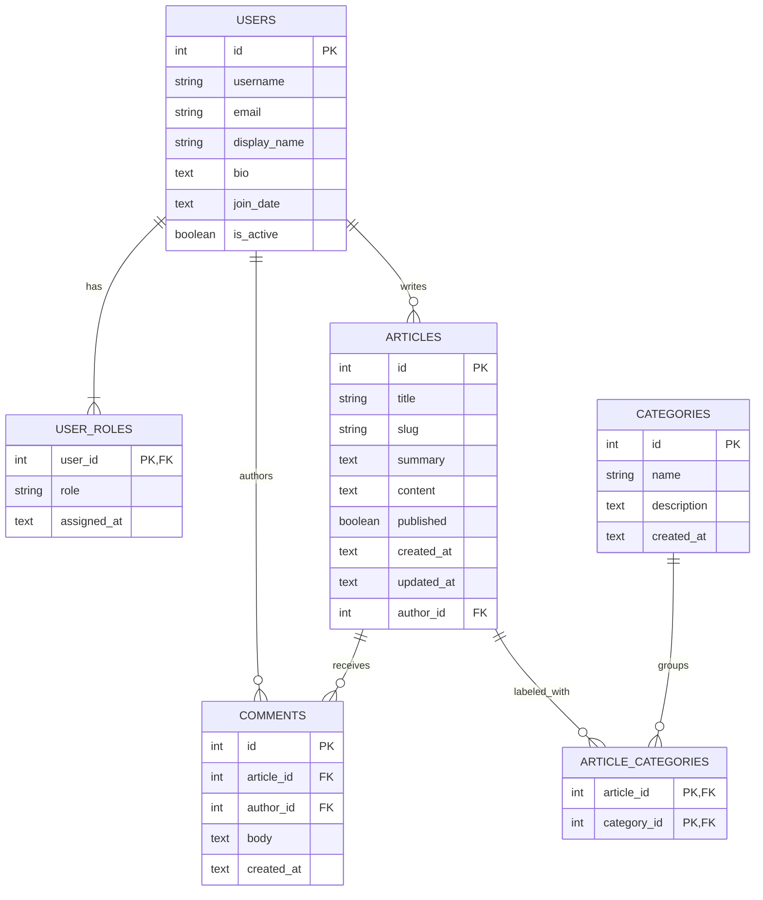

# Online Wiki E-R Diagram

**Notes**
- `USER_ROLES` enforces a single role per user while allowing cascading deletes when a user is removed.
- `ARTICLE_CATEGORIES` resolves the many-to-many relationship between `ARTICLES` and `CATEGORIES`.
- `COMMENTS` references both `USERS` and `ARTICLES` to preserve conversational context.
